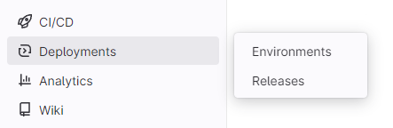
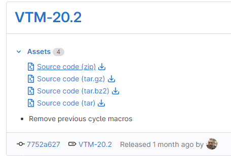
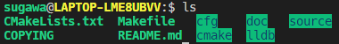
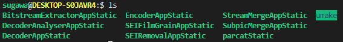
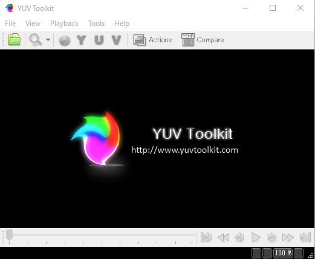
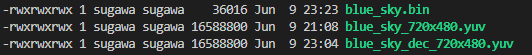

# VVCであそんでみる

VVCを試しに使ってみたときのメモです。コンフィグとかいじって圧縮率がどうなるか見ていきます。間違った情報とかあるかもしれないのであまり鵜呑みにしないでください。🙏

## VVCとは

AVCやHEVCよりもさらに高効率な符号化を可能とする映像圧縮符号化方式で、MPEGの合同組織として2015年10月に設立されたJVETにおいて進められたそうです。

2020年7月にできた映像コーデック

なんかHEVCと比較し30%～40%ほどの容量削減が可能らしい

ちなみにHEVCの時点で元のファイルサイズの0.3%ぐらいになるっぽい、、それの半分未満、すごいな

## VCCのセットアップ

この記事ではWindowsのWSLで実行します。たまに「エラーがでる！」って言ってWSLでコマンドを実行していない人をよく見かけます。

### ダウンロード

[ここ](https://vcgit.hhi.fraunhofer.de/jvet/VVCSoftware_VTM)にリポジトリがあります。

リンクを開いたら左の方にあるDeployments→Releasesをクリックしてください。



私がやった2023年06月09日は20.2が最新でした。zip, tar.gz, tar.bz2, tar の中から好きなのをダウンロードしてください。私はzipにしました。



ダウンロードしたらzipファイルを任意の場所に移動させ、解凍してください。解凍したらVVCSoftware_VTM-VTM-20.2の中身はこんな感じになってるハズ



### ビルド事前準備

ビルドに必要なプログラムをインストールします。下記の3つのコマンドを実行してください。aptの更新をしてから、cmakeとffmpegをインストールします。

```
sudo apt-get update
sudo apt install cmake
sudo apt install ffmpeg
```

`Do you want to continue? [Y/n]`って聞かれたら"y"を入力してEnterしてください。

ちょっと時間がかかる場合もあると思いますが大丈夫です。特にエラーが出なければ問題ないです。

### ビルド

VVCをビルドします。

mkdirコマンドでビルド用のディレクトリをVVCSoftware_VTM-VTM-20.2に作って移動してください。

```
mkdir build
cd build
```

以下の2つのcmakeコマンドとmakeコマンドを実行して下さい。makeコマンドでビルドが始まります。

```
cmake .. -DCMAKE_BUILD_TYPE=Release
make
```

私の環境では数分でビルドが終わりました。

## エンコードしてみる

### 素材

この記事ではXiph.Org Foundationの動画を使用します。[Xiph.Orgの動画](https://media.xiph.org/video/derf/)

HD Content and Aboveのblue_skyを試しに使います。1080pをクリックしてください。~~他の動画でもいいですが、サイズがデカいとダウンロードに時間かかるし処理にめっちゃかかって時間の無駄じゃね？~~

ダウンロードしたらblue_sky_1080p25.y4mをbinのディレクトリに入れて、移動してください。

```
cd ../bin
```

binの中はこのように実行ファイルがあると思います。



ダウンロードしたblue_sky_1080p25.y4mをffmpegでYUVに変更します。以下のコマンドを実行してください。blue_sky_1920x1080.yuvが生成されると思います。

```
ffmpeg -i blue_sky_1080p25.y4m -pix_fmt yuv420p -s 720x480 -vframes 32 blue_sky_720x480.yuv
```

`-i blue_sky_1080p25.y4m`は入力の指定です。blue_sky以外の動画をダウンロードした場合、この部分を正しいファイル名に変更してください。

`-pix_fmt yuv420p`はエンコーダに渡すピクセルフォーマットです。今回はyuv420pです。デジタル放送でも使われてるらしい(詳しくは知らない)

`-s 720x480`は出力サイズです。大きいと圧縮処理が重くなります。

`-vframes 32`は出力するフレーム数です。blue_sky_1080p25.y4mは217frameあります。そのまま217フレーム出力できますが、圧縮処理が重くなるため、32フレームに小さくしています。数字を小さくしたら動画が切り取られ、短くなります。

`blue_sky_720x480.yuv`は出力ファイルです。"720x480"をつける理由は後で説明します。

### YUVファイルの再生

YUVとは輝度信号(Y)と、青と赤2つの色差信号(UV)を使って色情報を表すデータフォーマットです。人間の目の特性を利用したデータ圧縮に便利らしいです。詳しくはEIZOの[こちら](https://www.eizo.co.jp/products/tech/files/2010/WP10-009.pdf)の資料を御覧ください。

YUVToolKitというアプリケーションでYUVの動画を再生できます。Windowsの場合、[こちら](https://code.google.com/archive/p/yuvtoolkit/downloads)からYUVToolkit-0.0.3.75.exeをクリックしてインストーラーをダウンロードして、yuvtoolkitをインストールしてください。

Windowsキーを押して「yuvtoolkit」と入力し、Enterを押せばYuvToolkitが起動します。



先程生成したblue_sky_720x480.yuvをドラッグ&ドロップでYuvToolkitに投げると再生されます。サイズはファイル名に「_720x480」とついていると、自動で合わせてくれます。再生が確認できれば問題有りません。

### エンコード

EncoderAppStaticでエンコードします。

```
./EncoderAppStatic -i blue_sky_720x480.yuv -c ../cfg/encoder_randomaccess_vtm.cfg -fr 30 -f 32 -wdt 720 -hgt 480 --InputBitDepth=8 --OutputBitDepth=8 --InternalBitDepth=8 -b ./blue_sky.bin
```

`-i blue_sky_720x480.yuv`は入力ファイル名です。

`-c ../cfg/encoder_randomaccess_vtm.cfg`はコンフィグの指定です。今回は/cfg/encoder_randomaccess_vtm.cfgを参照させています。コマンドラインでもconfigは設定可能です。コマンドラインのほうが優先されます。

`-fr 30`はフレームレートです。30にしていますが、30じゃないかもしれません。間違えてたら再生速度が変わるだけだと思う、、、

`-f 32`はフレーム数です。YUVにしたとき、32フレームだけにしました。

`-wdt 720 -hgt 480`は解像度です。

`-b ./blue_sky.bin`は出力ファイル名です。blue_sky.binって名前のファイルが圧縮されたファイルです。たぶん

`--InputBitDepth=8`は入力のビット深度です。YUV420は12bitだと思ったけど`Source image contains values outside the specified bit range!`って出てきてうまくできませんでした。8でうまく行けました。

`--OutputBitDepth=8`は出力のビット深度です。入力同様、8にしました。

`--InternalBitDepth=8`はコーディングに使用されるビット深度です。よくわからん


### デコード

DecoderAppStaticでデコードします。

```
./DecoderAppStatic -b blue_sky.bin -o blue_sky_dec_720x480.yuv
```

`-b blue_sky.bin` は解凍(デコード)したい圧縮されたバイナリファイルです。

`-o blue_sky_dec_720x480.yuv` は出力ファイル名です。わかりやすくするため、decをつけました。

出力された blue_sky_dec_720x480.yuv を YuvToolkit で再生してください。元の動画と比べて見てください。

青空にバンディングが出たり、レンズの汚れ？が変わったりしてるように見えます。(俺だけ？)

## サイズ比較

以下のコマンドで、ファイルのサイズをbyte単位で確認できます。

```
ls -l
```



36016 とか 16588800 がファイルサイズです。

`blue_sky_720x480.yuv` → **圧縮** → `blue_sky.bin` → **解凍** → `blue_sky_dec_720x480.yuv`

って感じになってる？ならすげぇ圧縮できてますね
